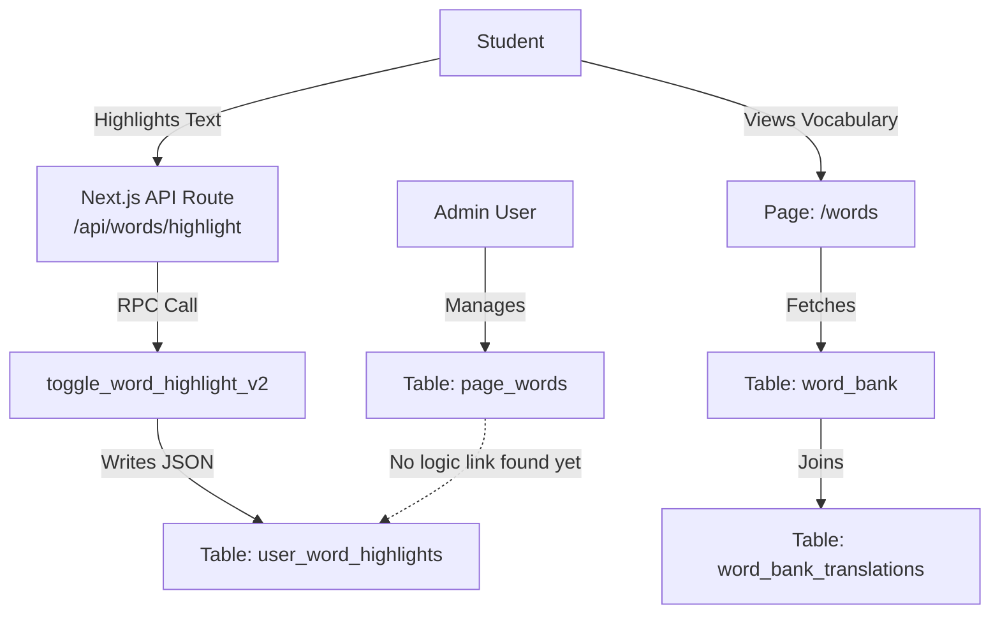

# دليل جداول لوحة التحكم: الاستخدام الفعلي والحالة (Audit)

هذا المستند يوضح الحقيقة "بدون مجاملة" عن حالة كل جدول: هل هو مستخدم فعلاً في الكود؟ وأين؟ وما هي المشاكل الموجودة؟

---

## 1. تظليل كلمات المستخدم (`user_word_highlights`)
**الحالة: نشط ومستخدم 🟢**

- **ما هذا؟**: الجدول الفعلي الذي يخزن "أكشن" التظليل الذي يوم به الطالب.
- **مكان الاستخدام في الكود**:
  - `app/api/words/highlight/route.ts`: هنا يتم استقبال طلب التظليل من المتصفح.
  - `toggle_word_highlight_v2` (Database Function): الدالة المسؤولة عن إضافة/حذف التظليل داخل قاعدة البيانات.
- **توضيح هام**:
  - المستخدم كان محقاً: التظليل يتخزن هنا مباشرة. البنية هي `JSONB` مرنة جداً.
  - **ملاحظة**: هذا الجدول هو "المخزن الحي" لتفاعلات الطالب مع النصوص.

---

## 2. بنك الكلمات (`word_bank`)
**الحالة: نشط ومستخدم 🟢**

- **ما هذا؟**: مخزن الكلمات والمفردات التي تظهر في صفحة "كلماتي" أو القاموس.
- **مكان الاستخدام في الكود**:
  - `app/words/page.tsx`: صفحة عرض الكلمات للطالب.
  - `app/admin/word-bank/page.tsx`: لوحة تحكم المسؤول لإضافة كلمات جديدة.
  - `app/api/words/word-bank/route.ts`: الـ API الذي يجلب الكلمات.

---

## 3. كلمات الصفحات (`page_words`)
**الحالة: غير واضح / استخدام إداري فقط ⚠️**

- **ما هذا؟**: جدول لتخزين كلمات النصوص الموجودة في الدروس لجعله قابلة للنقر.
- **مكان الاستخدام في الكود**:
  - `app/admin/page-words/page.tsx`: موجود فقط في لوحة تحكم الأدمن.
  - **المشكلة**: لم يتم العثور على استخدام واضح له في "صفحة الدرس" أو الـ "Reader" الخاص بالطالب في البحث الأولي للكود.
  - **التحليل**: غالباً واجهة المستخدم تعتمد على تظليل حر (أي كلمة في النص) وترسلها للـ API، دون الرجوع لهذا الجدول للتحقق، مما يجعله حالياً "جدول إداري" أو "ميزة غير مكتملة الربط".

---

## 4. اللغات المدعومة (`supported_languages`)
**الحالة: نشط (بنية تحتية) 🔵**

- **ما هذا؟**: قائمة اللغات (En, Ar, Fr...).
- **مكان الاستخدام**:
  - يستخدم كمرجع (Foreign Key) في كل الجداول السابقة لضمان صحة كود اللغة.

---

## 5. ترجمات بنك الكلمات (`word_bank_translations`)
**الحالة: نشط ومستخدم 🟢**

- **ما هذا؟**: جدول فرعي لترجمة كلمات `word_bank`.
- **مكان الاستخدام**:
  - يتم استدعاؤه دائماً مع `word_bank` في `app/api/words/word-bank/route.ts`.

---

## 6. مخزن الترجمة (`translation_cache`)
**الحالة: غير مؤكد الاستخدام في الكود الممسوح ⚠️**

- **ما هذا؟**: جدول "كاش" لتقليل التكلفة.
- **التحليل**: لم يظهر استخدامه بشكل صريح في ملفات الـ TypeScript التي تم فحصها، ولكنه قد يستخدم عبر Database Functions (مثل `get_cached_translation`) مباشرة من الـ Supabase Client، أو قد يكون ميزة مخطط لها لم تفعل بالكامل بعد.

---

## الخلاصة للمطور (The Spaghetti Reality 🍝):

1. **نظام التظليل (Highlighting)**: يعتمد كلياً على `user_word_highlights` وبنية JSON داخله. جدول `page_words` يبدو معزولاً في لوحة التحكم حالياً، ولا يتدخل في عملية التظليل الحية (وهذا يفسر ملاحظتك أن التظليل يتخزن في الـ user highlights مباشرة).
2. **نظام الكلمات (Vocabulary)**: مستقر ويعتمد على `word_bank` و `word_bank_translations`.
3. **التوصية**: إذا كان الهدف هو أن التظليل يكون "حر" (أي كلمة)، فجدول `page_words` قد يكون زائداً عن الحاجة أو يحتاج لإعادة توظيف (مثلاً لاقتراح كلمات للطالب).

---

## المخطط الواقعي (As-Is Architecture)

