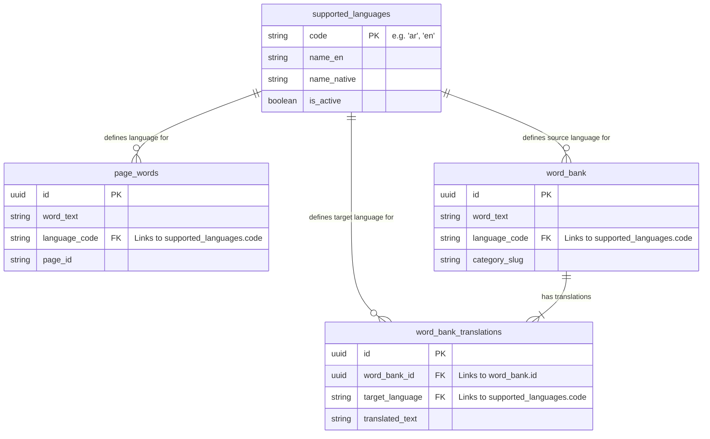

# Control Panel Relationships: Languages, Page Words, & Word Bank

This document details the specific relationships between the **Supported Languages**, **Page Words**, and **Word Bank** tables, as requested for the Control Panel implementation.

## 1. Supported Languages (`supported_languages`)
This is the master table for all languages enabled in the system.

- **PK**: `code` (e.g., 'ar', 'en')
- **Columns**: `name_en`, `name_native`, `is_active`, `direction`

## 2. Page Words (`page_words`)
Represents words extracted from specific pages for highlighting or "click-to-translate" features.

- **Relationship**: `page_words.language_code` ➤ `supported_languages.code`
- **Purpose**: Defines which language a word on a page belongs to.
- **Key Columns**:
  - `page_id`: Identifier for the page URL/Course.
  - `word_text`: The actual word.
  - `language_code`: FK to `supported_languages`.

## 3. Word Bank (`word_bank`)
The core vocabulary repository (dictionary) managed in the control panel.

- **Relationship**: `word_bank.language_code` ➤ `supported_languages.code`
- **Purpose**: Classifies a vocabulary word under a specific source language.
- **Key Columns**:
  - `word_text`: The base word.
  - `language_code`: FK to `supported_languages` (The language of this word).
  - `category_slug`: (Optional) Category classification.

## 4. Word Bank Translations (`word_bank_translations`)
Specific translations for words in the Word Bank.

- **Relationship 1**: `word_bank_translations.word_bank_id` ➤ `word_bank.id`
- **Relationship 2**: `word_bank_translations.target_language` ➤ `supported_languages.code`
- **Purpose**: Provides the translation of a Word Bank item into another supported language.

---

## Visual Diagram

